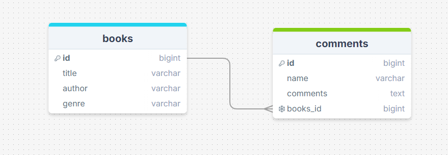
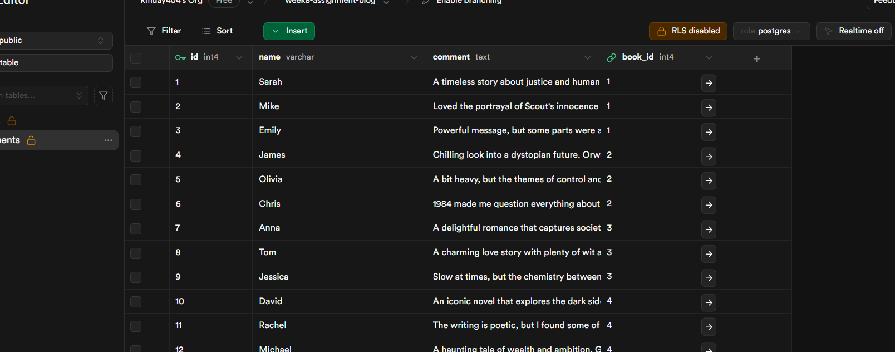
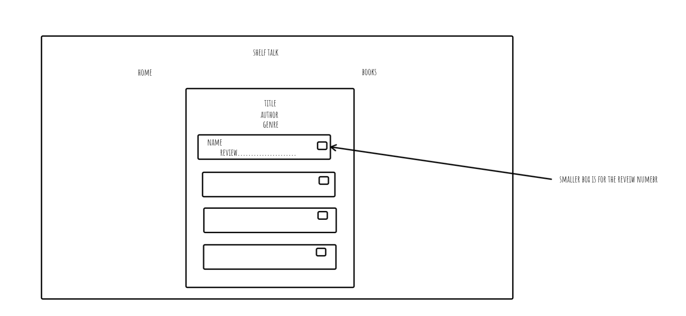
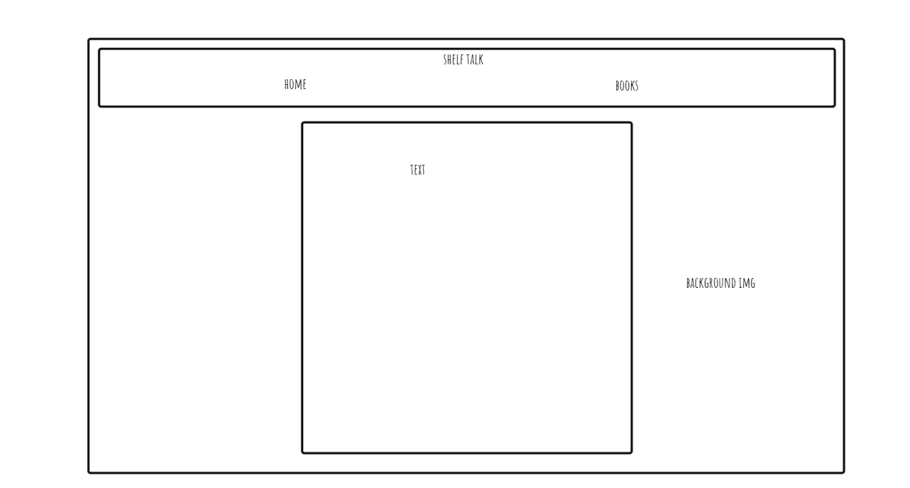

# Requirements

- Display all posts on the page, with an option to sort them in ascending or descending order.  
  Ascendng and descending is functional but this orders the id numbers, I ran out of time to make this sort alphabetically.
- Create a SQL schema for a posts table and a comments table, with the comments being connected to the posts table with a foreign key.  
  Two tables created and linked.
  - Please submit your database schema, as is mentioned in the submission instructions.  
    Screenshot added below
- Create a delete button on posts that allows users to delete the post from the database.  
  Users are able to delete comments
- Create a form which saves comments to a dedicated comments table, with the comments being connected to the posts table with a foreign key.  
  Complete
- Allow users to comment on individual posts in their dynamic routes. Comments should be associated with posts, and have a dynamic route (e.g. /posts/:postid).  
  Complete
- Add a redirect when a user creates a post to redirect them to the posts page.  
  Complete

My requirements/MVPs have been met.

My stretch Goals

- I wanted to add a form for the user to add books
-
-

Resources Used

- google, e.g. apostrophe in SQL table is a doube apostrophe
- tailwindcss.com
- the tailwind cheatsheet
- class demos
- chatGPT, generated my dummy data, the list of books and the reviews

